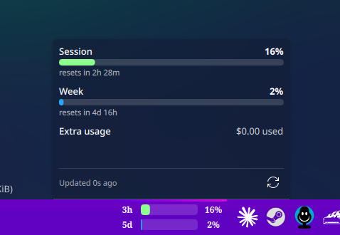
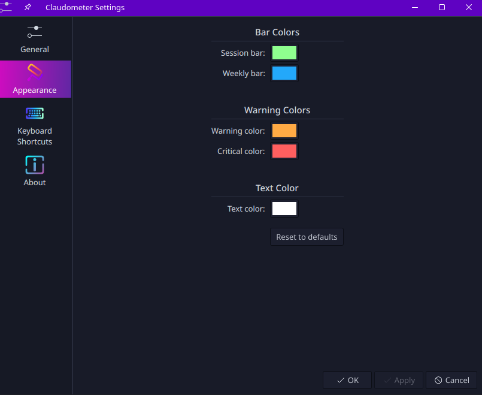

# Claudometer

Claude usage meters that live in your KDE Plasma 6 panel — because alt-tabbing
to a website to see how much runway you have left is a workflow bug.



Two bars, always visible: your **5-hour session limit** (green) and your
**weekly limit** (blue). Each row shows time remaining until reset, a fill
bar, and the exact percentage. Click for a popup with full-size meters,
pay-per-use credit tracking (if your account has it enabled), and a
manual-refresh button. Desktop notifications fire when you cross warning and
critical thresholds — once per crossing, not once per poll.

## How it works

Two pieces, one clean seam:

- **A QML plasmoid** owns all state and rendering: the compact panel bars,
  the popup, tooltips, and notification latching.
- **A Python helper** (stdlib only — nothing to `pip install`) runs on a
  timer, fetches usage from Anthropic's OAuth usage endpoint, and prints
  exactly one JSON envelope to stdout. That JSON is the entire interface
  between the two.

The helper finds your credentials wherever they already are — no API key to
paste, no configuration:

1. **Claude Code**: reads the CLI's credentials file directly.
2. **Claude Desktop**: the token is encrypted at rest with Chromium's
   OSCrypt v11 scheme. The helper fetches the Safe Storage password from
   KWallet over D-Bus, derives the AES key with PBKDF2, and decrypts the
   token cache via the `openssl` CLI.

If both exist, the freshest non-expired token wins.

## Built to be a polite API citizen

The usage endpoint is rate-limited, and repeatedly sending a dead token reads
as credential abuse and earns real penalties. The helper takes that
seriously:

- **Shared cache.** A successful fetch is cached for 30 seconds, so several
  widget instances polling on the same tick make one HTTP request between
  them.
- **429s are honored exactly.** The server's `Retry-After` is persisted to
  disk, survives `plasmashell` restarts, is shared across instances, and
  gates even the manual refresh button — you cannot re-trip a rate limit by
  clicking impatiently.
- **401s trigger a cooldown, not a retry loop.** A rejected token is
  fingerprinted and benched for 10 minutes — but the cooldown lifts early the
  moment a *different* token appears on disk (i.e. you signed in again).
- **Zombie tokens are quarantined.** Claude Desktop's cache migration leaves
  behind revoked tokens with expiry dates up to a year out. Naively picking
  "freshest expiry" would choose a corpse every time; the helper prefers the
  V2 cache outright and only falls back when it's absent.

Errors degrade gracefully in the UI: stale data dims the bars and says how
old it is, a cooldown shows a live countdown, and a fresh install with no
data shows a placeholder instead of bars pretending everything is fine.

## Install

```sh
git clone https://github.com/Trixles/claudometer.git
cd claudometer
./install.sh
```

Then right-click your panel → **Add Widgets** → **Claudometer**. The script
wraps `kpackagetool6` and handles install vs. upgrade automatically.

**Requirements:** KDE Plasma 6, Python 3, and a Claude subscription signed in
via Claude Code or Claude Desktop. Reading Desktop tokens additionally uses
`openssl` and `qdbus6`/KWallet, both stock on a Plasma system.

## Configuration

Everything lives in the widget's settings dialog:

- **General** — polling interval (default 300 s; the data changes slowly, so
  the default is deliberately gentle), notification toggle, and the warning /
  critical thresholds (70% / 90%).
- **Appearance** — every color is editable: session and weekly bar colors,
  warning and critical override colors, and the panel text.



## Security notes

- The Desktop-token decryption passes the AES key to `openssl` via argv,
  where it is briefly visible in `/proc`. On a single-user desktop this is an
  accepted trade-off: any local process could re-derive the same key from the
  KWallet password anyway.
- Desktop notifications are built from fixed strings and integer percentages
  only — no API-controlled text ever reaches the shell, so command injection
  through that path is structurally impossible.
- The helper talks to exactly one endpoint, over HTTPS, read-only.

## Tests

The helper's parsing and decision logic is covered by unit tests
(response parsing, `Retry-After` handling, token selection, cache/cooldown
decisions):

```sh
python -m pytest tests/
```

## License

MIT.
